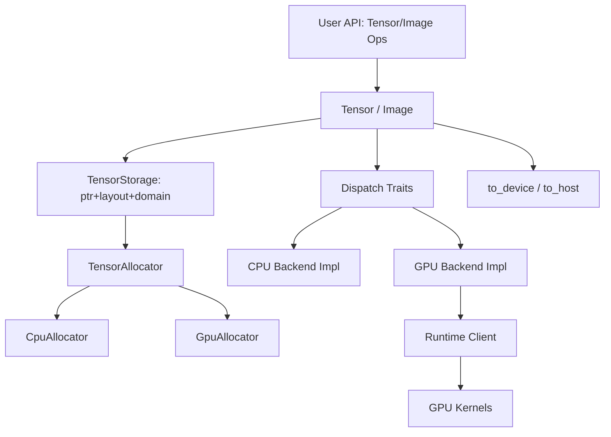

# Google Summer of Code 2026 Proposal

## Project Title
GPU acceleration for `kornia-tensor` and `kornia-imgproc`

## Organization
Kornia

## Contributor
- Name: Inchara J
- GitHub: https://github.com/Incharajayaram
- Discord: yor1837
- Email: incharajayaram2020@gmail.com
- Location: Bangalore, India (IST, GMT+5:30)
- Potential Mentors: Edgar Riba, Jian Shi, Christie Purackal

---

## 1. Abstract

`kornia-rs` currently provides CPU-centric execution for core tensor and image processing paths, while many high-impact operations (`resize`, `warp_affine`, color transforms) are naturally data-parallel and map well to GPU execution [1](https://arxiv.org/abs/2505.12425) [3](https://github.com/kornia/kornia-rs). As image sizes and throughput requirements increase, this limits real-time and robotics workloads where predictable latency matters [1](https://arxiv.org/abs/2505.12425).

The project introduces a minimal, feature-gated GPU backend with explicit memory-domain semantics and allocator-based dispatch. The design extends the existing `Tensor<T, N, A>` abstraction rather than replacing it, preserving API compatibility for CPU users while enabling device-resident execution where requested [3](https://github.com/kornia/kornia-rs) [4](https://github.com/kornia/kornia-rs/blob/main/crates/kornia-tensor/src/allocator.rs) [5](https://github.com/kornia/kornia-rs/blob/main/crates/kornia-tensor/src/storage.rs).

Primary backend direction is CubeCL, with native CUDA interop as an explicit fallback if integration or performance criteria are not met [8](https://github.com/tracel-ai/cubecl) [9](https://docs.rs/cubecl/latest/cubecl/) [13](https://docs.rs/cust/latest/cust/).

### 1.1 Candidate Details

I am an Electronics and Instrumentation Engineering student with a focus on systems programming, compiler/runtime behavior, and performance-oriented backend design. My preparation for this proposal has focused on `kornia-tensor` allocator/storage internals and `kornia-imgproc` execution paths to identify where host-memory assumptions currently block GPU support [3](https://github.com/kornia/kornia-rs) [4](https://github.com/kornia/kornia-rs/blob/main/crates/kornia-tensor/src/allocator.rs) [5](https://github.com/kornia/kornia-rs/blob/main/crates/kornia-tensor/src/storage.rs).

### 1.2 Prior Contributions

| PR | Description |
|---|---|
| [#3142](https://github.com/kornia/kornia/pull/3142) | Remove deprecation decorator from `depth_to_3d` |
| [#629](https://github.com/kornia/kornia-rs/pull/629) | Implement `pyrdown` |
| [#640](https://github.com/kornia/kornia-rs/pull/640) | Add EXIF metadata support |
| [#755](https://github.com/kornia/kornia-rs/pull/755) | Implement pyramidal optical flow LK |
| [#760](https://github.com/kornia/kornia-rs/pull/760) | Add EXIF orientation APIs to `kornia-io` |

---

## 2. Technical Details

### 2.1 Rationale Behind the Project

The targeted operations are pixel- and element-wise dominant and expose high data parallelism. Today, these paths are implemented in CPU loops and host-slice based access patterns [3](https://github.com/kornia/kornia-rs) [6](https://github.com/kornia/kornia-rs/blob/main/crates/kornia-imgproc/src/resize.rs).

The key architectural opportunity is that the tensor type already carries allocator parametrization (`Tensor<T, N, A>`), so backend specialization can be introduced via allocator-aware execution rather than public API redesign [4](https://github.com/kornia/kornia-rs/blob/main/crates/kornia-tensor/src/allocator.rs).

GPU acceleration in Rust vision stacks is still less mature than C++ ecosystems. Building this support in `kornia-rs` strengthens a native Rust path for real-time computer vision [1](https://arxiv.org/abs/2505.12425) [8](https://github.com/tracel-ai/cubecl).

### 2.2 Project Goals

1. Implement a feature-gated `GpuAllocator` in `kornia-tensor` with explicit `to_device()` / `to_host()` APIs and allocator-consistent ownership semantics [4](https://github.com/kornia/kornia-rs/blob/main/crates/kornia-tensor/src/allocator.rs) [5](https://github.com/kornia/kornia-rs/blob/main/crates/kornia-tensor/src/storage.rs).
2. Introduce backend-specialized tensor operation traits for unary/binary/reduction kernels.
3. Enable GPU execution for selected `kornia-imgproc` operations: resize (nearest/bilinear), `warp_affine`, `warp_perspective`, RGB<->Grayscale [6](https://github.com/kornia/kornia-rs/blob/main/crates/kornia-imgproc/src/resize.rs).
4. Preserve API compatibility and explicit memory semantics (no implicit host-device movement).
5. Finalize backend early with measurable selection criteria.
6. Validate correctness and speedup with reproducible benchmarks.

### 2.3 System Architecture Overview

The architecture is layered so safety and execution concerns stay separated:

1. Allocator + storage layer (`TensorStorage` domain awareness).
2. Compile-time safety layer (`CpuAccessible` gating for host-only APIs).
3. Dispatch layer (allocator-specialized traits for tensor/imgproc ops).
4. Backend execution layer (CubeCL primary, CUDA fallback).



---

## 3. Implementation Details

### 3.1 Building a GPU Allocator

The first implementation step is memory ownership correctness. A naive allocator addition is unsafe because current storage paths assume host-accessible pointers.

Immediate breakages if `GpuAllocator` is introduced alone:

1. `as_slice()` / `as_mut_slice()` on device pointers -> undefined behavior [5](https://github.com/kornia/kornia-rs/blob/main/crates/kornia-tensor/src/storage.rs).
2. `from_shape_vec(..., GpuAllocator)` can cause allocator/deallocator domain mismatch through `from_vec` + `Drop` ownership assumptions [5](https://github.com/kornia/kornia-rs/blob/main/crates/kornia-tensor/src/storage.rs).
3. Tensor/imgproc loops relying on `.as_slice()` fail for device memory [3](https://github.com/kornia/kornia-rs) [6](https://github.com/kornia/kornia-rs/blob/main/crates/kornia-imgproc/src/resize.rs).

I will make storage domain-aware (`Host | Device`) and compile-time gate host-only APIs.

Core API intent in this phase:

- `as_slice` / `as_slice_mut`: host allocators only.
- `from_shape_vec`: host construction path only.
- `to_device` / `to_host`: explicit transfer path.
- no implicit copy behavior in generic constructors.

This aligns with Rust allocation/layout safety requirements and explicit ownership discipline [15](https://doc.rust-lang.org/std/alloc/trait.Allocator.html) [16](https://doc.rust-lang.org/std/alloc/struct.Layout.html).

### 3.2 Enable Allocator-Based Device Dispatch for Tensor Operations

After storage/domain safety is established, tensor operations move to allocator-based dispatch via backend-specialized traits.

Dispatch scope:

1. Unary ops (`abs`, `relu`, `clamp`, `neg`).
2. Binary ops (`add`, `sub`, `mul`, `div`, `min`, `max`).
3. Reductions (`sum`, `mean`).

Dispatch is resolved by allocator type parameter, preserving zero-cost generic behavior and avoiding runtime trait-object dispatch.

### 3.3 GPU-Accelerated Image Processing Operations

The same backend dispatch pattern is extended to selected high-impact image ops:

1. `resize` (nearest, bilinear)
2. `warp_affine`
3. `warp_perspective`
4. RGB<->Grayscale

Public APIs remain stable while execution is delegated to backend modules. This keeps CPU behavior unchanged and enables device-resident execution where allocator type is GPU [6](https://github.com/kornia/kornia-rs/blob/main/crates/kornia-imgproc/src/resize.rs).

### 3.4 GPU Kernel Execution Model

Execution model for resize/warp kernels is output-parallel:

1. one thread -> one output pixel
2. inverse map output coordinates -> source coordinates
3. sample (`nearest` / `bilinear`)
4. write output pixel

This structure avoids inter-thread synchronization for these operations and matches established GPU image-processing patterns [18](https://docs.nvidia.com/cuda/).

### 3.5 Backend Selection

Two backends are in scope:

1. CubeCL (primary): Rust-native kernels, multi-runtime targeting, lower direct FFI surface [8](https://github.com/tracel-ai/cubecl) [9](https://docs.rs/cubecl/latest/cubecl/) [10](https://github.com/tracel-ai/cubecl/tree/main/examples).
2. Native CUDA interop (fallback): mature NVIDIA tooling, but higher FFI/vendor coupling [13](https://docs.rs/cust/latest/cust/) [14](https://github.com/Rust-GPU/Rust-CUDA) [18](https://docs.nvidia.com/cuda/).

Decision lock criterion is benchmark-driven and finalized early to avoid mid-project architecture churn.

### 3.6 Backend Integration: CubeCL Primary, CUDA Fallback

GPU support is fully feature-gated.

```toml
[features]
default    = []
gpu        = []
gpu-cubecl = ["gpu", "dep:cubecl", "dep:cubecl-cuda"]
gpu-cuda   = ["gpu", "dep:cust"]
```

Runtime context is held by `GpuAllocator` (`ComputeClient` ownership), and allocation/deallocation is routed through runtime handles rather than `std::alloc` paths [8](https://github.com/tracel-ai/cubecl) [9](https://docs.rs/cubecl/latest/cubecl/).

Explicit transfer remains mandatory:

```rust
let gpu_tensor = cpu_tensor.to_device(gpu_alloc)?;
let out = run_gpu_ops(gpu_tensor)?;
let host_out = out.to_host(CpuAllocator)?;
```

Kernels are authored in `#[cube]` style and launched with explicit launch configuration, while results remain device-resident until explicit copy-back.

### 3.7 Validation and Benchmarking

Validation and benchmarking are integrated.

Validation layers:

1. allocator/storage correctness (domain and drop semantics)
2. CPU-vs-GPU parity tests
3. boundary-condition tests (warp/resize edges and invalid transforms)
4. integration tests on real image pipelines

Compile-fail validation uses `trybuild` for host-API gating on device tensors [17](https://docs.rs/trybuild/latest/trybuild/).

Benchmark layers:

1. Layer A: microbenchmarks (1M/10M/100M element unary/binary/reduce)
2. Layer B: allocator-dispatched tensor op latency and overhead
3. Layer C: image benchmarks (1080p/4K resize, warp, color)

Measurement rules:

- warmup before timed runs
- explicit sync around timed GPU regions
- H2D/kernel/D2H reported separately
- CPU baseline on same inputs

---

## 4. GSoC Timeline (350 Hours)

### Community Bonding (Weeks 1-2, 40h)

| Week | Hours | Activities | Deliverable |
|---|---:|---|---|
| 1 | 20 | Architecture review, allocator/domain design confirmation | Final design spec + architecture diagram |
| 2 | 20 | CPU baseline harness, backend decision rubric, PR sequencing | Baseline benchmark harness + backend lock criteria |

### Coding Phase 1 (Weeks 3-9, 140h)

| Week | Hours | Activities | Milestone |
|---|---:|---|---|
| 3 | 20 | GPU feature scaffold + allocator skeleton | PR-1 |
| 4 | 20 | Domain-aware storage + ownership fixes | PR-2 |
| 5 | 20 | Compile-time host API gating | PR-3 |
| 6 | 20 | Explicit transfer APIs + tests | PR-4 |
| 7 | 20 | Tensor dispatch traits (CPU integration) | PR-5 |
| 8 | 20 | CubeCL tensor kernels + parity tests | PR-6 |
| 9 | 20 | Tensor-ops integration + error model | PR-7 |

Midterm target: feature-gated allocator, explicit transfer semantics, and allocator-based tensor dispatch.

### Coding Phase 2 (Weeks 10-18, 170h)

| Week | Hours | Activities | Milestone |
|---|---:|---|---|
| 10 | 20 | Imgproc backend dispatch layer | PR-8 |
| 11 | 20 | GPU resize kernels | PR-9 |
| 12 | 20 | GPU `warp_affine` + tests | PR-10 |
| 13 | 20 | GPU `warp_perspective` + tests | PR-11 |
| 14 | 20 | GPU color conversion kernels | PR-12 |
| 15 | 20 | Layer A/B benchmarking | PR-13 |
| 16 | 20 | Layer C benchmarking + tuning | PR-13 update |
| 17 | 20 | Stabilization, docs, examples | PR-14 |
| 18 | 10 | Final reporting and polish | Final submission package |

---

## 5. About Me

I am interested in systems-level ML infrastructure where memory models, dispatch design, and execution backends matter as much as algorithmic correctness. This project is a strong fit because it combines architecture-safe extension work (allocator/domain semantics) with measurable performance engineering and maintainability constraints.

---

## 6. References

1. E. Riba, J. Shi, A. Kumar, A. Shen, G. Bradski. Kornia-rs: A Low-Level 3D Computer Vision Library In Rust: arXiv:2505.12425, 2025. https://arxiv.org/abs/2505.12425
2. E. Riba, D. Mishkin, D. Ponsa, E. Rublee, G. Bradski. Kornia: An Open Source Differentiable Computer Vision Library for PyTorch. WACV 2020: https://arxiv.org/abs/1910.02190
3. kornia-rs repository: https://github.com/kornia/kornia-rs
4. kornia-rs TensorAllocator source: https://github.com/kornia/kornia-rs/blob/main/crates/kornia-tensor/src/allocator.rs
5. kornia-rs TensorStorage source: https://github.com/kornia/kornia-rs/blob/main/crates/kornia-tensor/src/storage.rs
6. kornia-rs imgproc resize implementation: https://github.com/kornia/kornia-rs/blob/main/crates/kornia-imgproc/src/resize.rs
7. GSoC 2026 project idea: GPU acceleration for kornia-tensor and kornia-imgproc: https://github.com/kornia/kornia-rs/wiki/%5B2026%5D-Google-Sumer-of-Code-Application
8. CubeCL repository: https://github.com/tracel-ai/cubecl
9. CubeCL crate documentation: https://docs.rs/cubecl/latest/cubecl/
10. CubeCL examples (matmul, reduce): https://github.com/tracel-ai/cubecl/tree/main/examples
11. Burn CubeCL backend, direct architectural analog to GpuAllocator dispatch model. https://github.com/tracel-ai/burn/tree/main/crates/burn-cubecl
12. Vectorware blog: Rust std on GPU https://www.vectorware.com/blog/rust-std-on-gpu/
13. cust crate documentation: https://docs.rs/cust/latest/cust/
14. Rust-CUDA project https://github.com/Rust-GPU/Rust-CUDA
15. Rust Allocator trait (std::alloc): https://doc.rust-lang.org/std/alloc/trait.Allocator.html
16. Rust Layout type (std::alloc::Layout): https://doc.rust-lang.org/std/alloc/struct.Layout.html
17. trybuild crate; compile-fail test infrastructure used in validation layer: https://docs.rs/trybuild/latest/trybuild/
18. NVIDIA CUDA Toolkit documentation. https://docs.nvidia.com/cuda/
